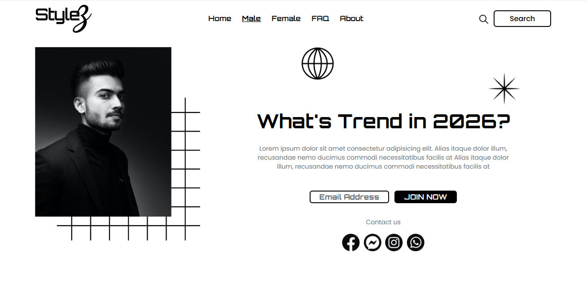
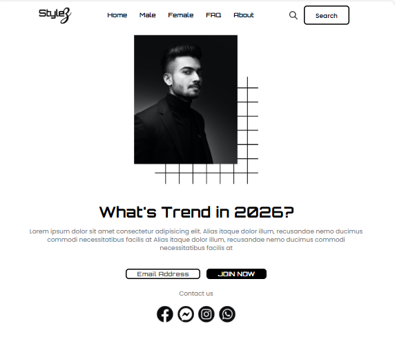
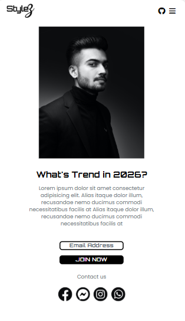
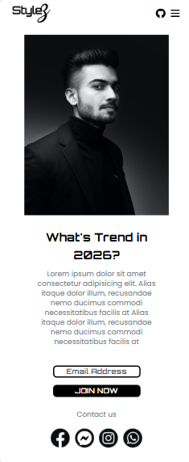

# Trend Landing Page (Stylez)

A responsive and modern landing page designed to showcase trending content (e.g., fashion, products, or lifestyle themes). This layout focuses on clean structure, typography, and a visually engaging hero section.

---

## Preview






---

## Features

* Responsive layout for mobile, tablet, and desktop
* Navigation bar with menu and search functionality
* Hero section with featured content
* Call-to-action buttons (Email / Join Now)
* Social media contact section
* Clean and structured UI using Tailwind CSS

---

## Tech Stack

* HTML5
* Tailwind CSS (via CDN)
* Font Awesome (optional for icons)
* Google Fonts (Poppins, Roboto, Orbitron)

---

## Project Structure

```bash
project-folder/
│
├── index.html
├── images/
│   ├── logo.png
│   ├── Image.png
│   ├── squares.png
│   ├── globe.png
│   ├── star.png
│   ├── facebook.png
│   ├── messenger.png
│   ├── insta.png
│   └── whatsapp.png
└── README.md
```

---

## Getting Started

1. Download or clone the repository:

```bash
git clone https://github.com/Sushara/Stylez.git
```

2. Open the project:

Open `index.html` in your browser.

---

## Customization

You can easily customize the project:

* Update heading and description text
* Replace images inside the `/images` folder
* Modify fonts and spacing using Tailwind classes
* Update navigation items

---

## Deployment

You can deploy this project using:

* GitHub Pages
* Netlify
* Vercel

---

## Notes

* This project uses Tailwind via CDN, so no build setup is required
* Internet connection is required for fonts and icons to load

---

## License

Free to use for personal and educational purposes.

